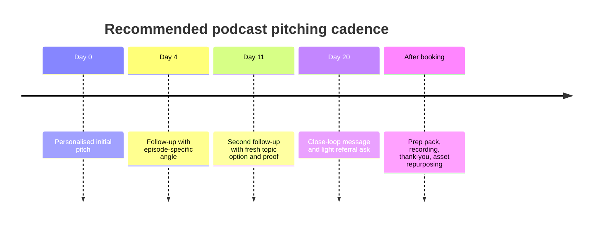

# Podcast Guesting and Pitching Research

## Larry's filing note

This is the canonical reference for [[podcast-guesting-workflow]] and [[podcast-guesting]]. The original report was saved from `D:/Alyssa/Downloads/deep-research-report.md` and renamed into this file on 2026-06-04.

Use this as a working reference for designing a weekly podcast guesting system, not as a final vendor-buying guide. The workflow patterns are useful now; platform pricing, conversion claims, audience metrics, and contact routes should be freshly verified before Alyssa buys tools or starts scaled outreach.

## Quick operating takeaway

Podcast guesting should be treated like account-based business development with media mechanics attached: position the guest, define the right shows, research recent episodes, write relevant pitches, follow up, prepare well, repurpose the appearance, and track outcomes.

Best next shape: AI drafts and organizes, [[camila]] verifies and operates the tracker, Wren polishes anything that needs Alyssa's voice, Pax verifies the show list, Mack wires reminders/automation, and a future Podcast Guesting Producer owns the full weekly pipeline.

## Weekly workflow reference

This is the first-pass weekly rhythm to extract when Alyssa comes back to build the system:

- **Monday:** update positioning, guest angles, and target criteria; add 10 to 20 possible shows to the tracker.
- **Tuesday:** qualify shows for relevance, audience fit, recent episode themes, guest format, and reachable contact path.
- **Wednesday:** send 5 to 10 highly personalized pitches that reference recent episodes.
- **Thursday:** send scheduled follow-ups; prep host/show briefs for any booked interviews.
- **Friday:** update the scorecard: pitches sent, replies, positive replies, bookings, declines, ghosted, follow-up due, content repurposed, leads generated.

## AI plus Camila split

AI is best used for target discovery, episode summarization, angle matching, first-draft pitches, follow-up variants, prep briefs, transcript repurposing, and tracker cleanup.

[[camila]] is best used for final show-fit judgment, contact verification, relationship-sensitive personalization, voice/positioning cleanup before approval, pitch sending after approval, reply logging, and follow-up discipline.

The clean split: AI drafts and organizes; Camila selects, edits, approves with Alyssa when needed, sends, and keeps the tracker alive.

## Future team-member recommendation

Nolan's recommendation is to hire a dedicated **Podcast Guesting Producer** rather than assigning end-to-end ownership to an existing specialist.

Candidate role name: **Mara - Podcast Guesting Producer**.

Scope: own the weekly podcast guesting system from target criteria to booked appearances: show research brief, fit scoring, pitch angle, outreach queue, contact verification, follow-up schedule, booking prep, scheduling handoff, post-episode asset handoff, and weekly reporting.

Support model:

- Pax: target-show research, audience fit, category intelligence, red flags.
- Wren: pitch language, Alyssa bio, one-sheet copy, talking points.
- Mack: tracker, CRM, reminders, scheduling integrations, follow-up automation.
- [[camila]]: operational execution, contact verification, tracker updates, approved pitches, replies, follow-ups.
- Larry: weekly routing and decision escalation.

## Verification note

Before acting on the tool section, verify current pricing, platform coverage, deliverability rules, audience metrics, contact accuracy, and whether each show is actively accepting guests. The report contains citation artifacts from the original deep-research export, so treat embedded source markers as breadcrumbs rather than clean citations.

## Executive summary

For a professional B2B service provider, creator, strategist, coach, consultant, or founder, podcast guesting works best when it is treated like account-based business development with media mechanics attached. Across the strongest workflows I reviewed, the same spine keeps appearing: sharpen positioning, define guest criteria, build a constrained target list, personalise outreach around recent episodes, follow up with discipline, prep the guest, then repurpose the interview and track commercial outcomes. The difference between weak and strong programmes is rarely charisma. It is operating system quality. citeturn10view0turn12view0turn9view0turn14view4turn8view0

The practical market split is clear. If you want fast access to visibly open opportunities, matching platforms like PodMatch, MatchMaker.fm, Talks, PodcastGuests.com, and Guestio lower friction and reduce cold outreach. If you want scale and precision, research and outbound tools like PodPitch, Podseeker, Rephonic, Podchaser Pro, and Podcast Hawk are stronger. If you want broader brand authority, PR platforms like Qwoted, Featured, Prowly, Muck Rack, and SparkToro help you find adjacent opportunities and sharpen audience targeting, even when they are not podcast-only. citeturn31view1turn32view1turn33view1turn21search6turn34view0turn16view1turn28view0turn27view1turn29search2turn19view1turn26view1turn26view0turn24search18turn24search5turn30search5

AI is already baked into the modern stack, but mostly in the unglamorous places: match prediction, fit scoring, writing-style mimicry, email drafting, contact enrichment, follow-up automation, and reporting. The strongest public examples still keep humans close to the work. PodPitch explicitly keeps approval with the operator before sending; Podseeker scores fit and drafts, but still relies on user judgment; MatchMaker.fm and Talks use AI matching, but the actual booking still depends on credible positioning and relevant conversation. In other words, AI can hand you a sharper knife, but it still expects you not to juggle it barefoot. citeturn16view1turn28view0turn32view1turn33view1turn19view3

For your niche, the highest-ROI path is usually a barbell strategy. One side is a tight set of high-authority dream shows that build borrowed credibility. The other side is a larger set of highly relevant mid-market shows that are actually bookable and closer to your buyer or peer audience. Fame’s B2B guidance is especially blunt here: 100 downloads from the right ICP is more valuable than 10,000 random listeners, and strategic guest selection can drive materially higher ROI than audience-chasing alone. citeturn14view2

## How the market actually works

Public podcast audience data is patchy. Exact download numbers are often private, so the most usable public proxies are Listen Notes Global Rank and Listen Score, Apple ratings volume, Podchaser ratings and episode counts, visible platform/network size, and whether the show publicly invites guests or appears inside open guest marketplaces. Listen Notes itself describes Listen Score as a comparative popularity metric, not a direct download count. Podchaser and Rephonic similarly position their tools around estimates, contact data, and comparative research rather than universally public exact numbers. citeturn20search18turn29search2turn27view1

That makes one strategic point more important than most founders realise: bookability is a metric. A show with slightly smaller reach but a public guest route, strong topical alignment, and a professional post-booking process is often worth more to a B2B expert than a celebrity show with no visible access path. MatchMaker.fm, Talks, PodMatch, and PodcastGuests.com all lean into this by making open guest opportunities, profile discovery, or in-app collaboration part of the product itself. citeturn32view1turn32view2turn33view1turn31view1turn21search6

The most credible performance benchmarks I found from current tools and agencies point in the same direction. PodPitch reports 537,000 plus pitches sent, a 67 percent open rate, a 23 percent reply rate, and an average of 7 to 9 podcast bookings per month. Podseeker, using a different workflow, reports an average 11.8 percent reply rate across 8,757 pitches and 2.5 percent of first pitches becoming guest bookings, while noting well-targeted campaigns do better. Fame reports that 98 percent of clients saw 10 percent or more monthly growth in their first six months, with average client downloads of 18,957 in the first six months and 68,524 in the first twelve. Those are different models, but they agree on one thing: targeting quality and process discipline matter more than raw volume. citeturn16view1turn28view0turn14view3


The diagram above is a synthesis of the public workflows from Interview Valet, Kitcaster, Command Your Brand, Fame, PodPitch, and Podseeker. Their branding differs; their backbone barely does. citeturn10view0turn12view0turn9view0turn14view4turn16view1turn28view0

## Real-world podcast pitching workflows

### Comparative workflow table

| Workflow example | Step-by-step internal process | Roles involved | Public timing and cadence | Measurable KPIs | AI and automation | Best applicable hack | Primary source |
|---|---|---|---|---|---|---|---|
| **Interview Valet** | Week 1 onboarding, past interviews review, audience insight analysis, dashboard setup, strategy walkthrough, asset creation; Weeks 2 to 5 personalised host introductions, logistics, preparedness training, optimisation call; Week 6+ recordings, promotion, repurposing, performance tracking | Client expert, Podcast Relationship Manager, booking/logistics team | Explicit phased workflow; weekly onboarding ramp, then active placement and momentum stacking | 20,000+ podcast partners; IV guests reportedly 25x more likely to be invited than non-IV guests; lead and revenue focus rather than vanity metrics | Public evidence is mostly human-concierge; the site also references a new Podcast Authority Score partnership with PodEngine.ai | Build a real post-appearance layer. They do not stop at booking, they deliberately repurpose and track | citeturn10view0turn11view0 |
| **Kitcaster** | Identify ideal audience based on desired outcomes; build podcast-specific media kit; pitch, pre-produce, schedule, and place interviews; conduct Story Craft sessions / modern media training | Client expert, podcast agent, agency team of eight in Denver handling pitch, pre-production, scheduling | Cohorts start on the 1st or 15th; six-month campaigns mentioned; client time commitment about one hour per week | Entry plan from US$2,100 per month; public case examples include 12 interviews leading to business with 3 hosts, and one investor hearing about a company via a Kitcaster-booked appearance | No explicit AI disclosed in the opened pages; the public positioning is high-touch and human-led | Put everything the guest needs directly into the calendar invite, including host, topics, and recording link | citeturn12view0turn12view1turn12view2turn13view2 |
| **Command Your Brand agency workflow** | Strategy intake; guest success formula; custom bio and talking points approval; launch interview; guest handbook and show targeting; custom outreach campaign; guest interviews; programme performance monitoring and Podcast Value Analysis | Founder or executive, strategists, outreach team, scheduling team | Eight-phase process; campaign-level monitoring throughout programme | 6,000+ interviews booked; 250+ founders featured; public client claims include US$500,000 in course sales from one campaign and tripled inbound leads in 90 days; minimum reach standard stated at 1,000+ | Public pages emphasise process and measurement, not AI | Add a “value analysis” layer at the end of every campaign so guesting becomes a financial channel, not a vibes hobby | citeturn9view0 |
| **Command Your Brand internal assistant-run system** | Define role and objectives; set guest criteria; document research steps, contact sourcing, personalisation rules, follow-up timelines; create approved messaging and talking points; track metrics; manage calendar and host communications; run thank-you and relationship system; prioritise shows tied to revenue goals | Founder, assistant, or team member | Ongoing operational cadence, delegated away from founder | Track pitches sent, responses received, interviews booked, and shows completed | No explicit AI disclosed, but the process architecture is AI-ready | Train an assistant to own the motion. Podcast pitching that lives only in the founder’s head eventually stalls | citeturn8view0 |
| **Fame B2B authority and pipeline model** | Positioning and strategy first; select shows aligned to authority and ICP; connect content to CRM and pipeline; build UTM links and attribution; use guest selection strategically, including target accounts; measure influenced pipeline and deal velocity | Marketing lead, content/PR team, sales ops or CRM owner, executive guest | Fame’s ROI guidance suggests initial signals in 3 to 6 months, fuller ROI usually within 12 months when attribution is set up early | 150+ B2B customers since 2020; 98% of clients reportedly saw 10%+ monthly growth in first 6 months; average 18,957 downloads in 6 months and 68,524 in 12 months; strategic guest selection reported as producing 3x higher ROI than audience-focused approaches | Fame site architecture includes Fame AI and AI-assisted resources, but the core operating lesson is attribution discipline | Treat podcasts like pipeline infrastructure. Create CRM fields for guest appearance, episode engagement, and influenced deals before the first pitch goes out | citeturn14view1turn14view2turn14view3 |
| **PodPitch software-led outbound** | Search 3.85M+ podcasts by topic, audience size, history; upload writing samples; generate unique pitches referencing recent episodes; send from real inbox; track opens/replies; automate follow-ups in the same thread; approve before sending | Founder or PR operator, optional comms team | Set up in about 15 minutes; average user reportedly spends under 30 minutes per week; can send up to 750 personalised emails weekly | 537K+ pitches, 67% open rate, 23% reply rate, 7 to 9 bookings per month on average, spam rate 15x lower than average email | Strongest explicit AI workflow in this research pass, including writing-style mimicry and recent-episode personalisation | Feed the system your own past writing so the pitch sounds like you, not like every other intern’s ChatGPT crime scene | citeturn16view1 |
| **Podcast Hawk humans-in-the-loop workflow** | Use AI-powered database and proprietary email pitching system; blend AI speed with human judgment; support both DIY SaaS and done-for-you modes; connect guesting to ROI and transcript/GEO outcomes | Founder or marketer, or Podcast Hawk expert team | Public pages emphasise auto-pilot booking and ongoing blog education; exact cadence not fully disclosed in opened sources | 4M+ podcast database; public source describes the workflow as humans-in-the-loop and ROI-oriented | Explicit AI-powered database and proprietary pitching system; blog explicitly advocates humans-in-the-loop guest booking | Use AI to narrow and draft, then have a human cut every list and message before it goes out | citeturn19view0turn19view1turn6search19 |
| **Podseeker data-driven PR workflow** | Search by 200+ outreach topics; assess Client Fit and Pitch Score; pull host and producer emails; draft in app; send from Gmail or Outlook; schedule unlimited follow-ups that pause upon reply; manage client profiles and campaign threads; export booking intelligence | PR freelancer, agency team, in-house marketer | Monthly pitch quotas on plans; follow-ups are unlimited and only the first pitch counts against quota | Average reply rate 11.8%; 2.5% of pitches book a guest spot on average; top Grow users pay under US$10 per booking; well-targeted campaigns exceed average | AI pitch refinement optional; scoring system adds structured QA to drafts | Fit score first, pitch volume second. Their own data argues that targeting quality changes outcomes dramatically | citeturn28view0turn28view1 |

### What these workflows have in common

The common operators are unusually consistent. Good teams start with positioning before prospecting, create a compact set of approved assets before a single email is sent, personalise against recent episodes, track response and booking data, and build a post-interview leverage system that can generate more reach than the interview itself. The agency examples also show that roles separate naturally into strategy, research, pitch writing, scheduling, guest prep, and post-show amplification. If one person must do all of that, the system needs tooling or it turns into a recurring administrative swamp. citeturn10view0turn12view0turn9view0turn8view0turn16view1turn28view0

### A practical outreach cadence

The most defensible modern cadence for email-led guesting, based on the tools and operating models above, is a four-touch sequence over roughly three weeks.



This cadence aligns with the public emphasis on follow-up timelines from Command Your Brand, same-thread automations from PodPitch, and unlimited follow-ups with pause-on-reply logic from Podseeker. Matching platforms like PodMatch, MatchMaker.fm, Talks, and Guestio compress the cadence because the host has already self-selected into a marketplace workflow. citeturn8view0turn16view1turn28view0turn31view1turn32view1turn33view1turn34view0

## Ranked podcast targets

### Ranking method

I ranked the shows below for a default niche of professional B2B service founder, strategist, coach, creator, consultant, or SaaS-adjacent operator. The score balances relevance, authority proxy, evidence of guest openness, and practicality. Where exact audience size was not public in the sources opened for this report, I mark that plainly and use the best public proxy available. The top of this list is a mix of authority builders and realistic growth targets; the middle gets more bookable; the bottom is an extended opportunity bench. citeturn20search18turn29search2turn31view1turn32view1

### Priority targets with the strongest fit

| Rank | Podcast | Best public metric found | Format and guest profile | Booking contact or process | Why it fits your niche | Source |
|---|---|---|---|---|---|---|
| **1** | **My First Million** | Listen Notes Global Rank Top 0.05%; Apple 4.7 with 2.6K ratings; 871 episodes on Apple page at the time fetched | Founder and operator conversations, business ideas, trend breakdowns, occasional big-name guests | No public guest form surfaced in the opened sources; treat as warm-intro / producer route | Excellent if your angle is category-building, content systems, business design, audience growth, or contrarian market insight | citeturn20search0turn20search4turn20search2 |
| **2** | **Marketing Against the Grain** | Listen Notes Global Rank Top 0.5%, Listen Score 50 | HubSpot-led marketing and growth interviews, strong fit for AI, content, GTM, and operator insights | Official show page was visible, but I did not locate a public guest application in the opened sources | Strongest “default yes” for a nuanced B2B marketing or creator-education expert | citeturn20search8turn20search14turn20search6 |
| **3** | **Ahrefs Podcast** | Public metric not surfaced in opened sources | Two-hour consulting style conversations with founders and CMOs, hosted by Tim Soulo; marketing and community building focus | Public guest process not surfaced in opened sources | Ideal if your pitch is tactical marketing, authority systems, audience building, or creator-business mechanics | citeturn17search1 |
| **4** | **Remarkable Marketing Podcast** | Public metric not surfaced in opened sources | Short story-driven marketing interviews; explicitly about marketers sharing remarkable work | PodMatch listing indicates open host profile inside PodMatch | Good mid-market marketing target with a practical, operator-heavy audience | citeturn7search16turn31view1 |
| **5** | **Software Spotlight** | Public metric not surfaced in opened sources | Weekly B2B SaaS-focused insights; host listing says it targets listeners staying ahead in software innovation | PodMatch host listing, platform-based booking path | Very strong if your work touches SaaS growth, operations, AI, positioning, or customer education | citeturn7search20 |
| **6** | **Founders Podcast** | Public metric not surfaced in opened sources | Interviews with proven founders and industry experts, according to the PodMatch listing | PodMatch host listing | Strong founder and expert fit, especially for stories with operational lessons and market positioning | citeturn7search12 |
| **7** | **Management Blueprint** | Public metric not surfaced in opened sources | MatchMaker listing describes interviews with CEOs and entrepreneurs about frameworks used to build and scale businesses | In-app MatchMaker.fm route | High relevance for frameworks, audience systems, and founder operating models | citeturn32view1 |
| **8** | **The Authority Business Show** | Public metric not surfaced in opened sources | MatchMaker open-opportunity listing positions it around expert insight and scalable growth | In-app MatchMaker.fm route | Very aligned for consultants, coaches, strategists, and thought leadership operators | citeturn32view2 |
| **9** | **IT Visionaries** | Public metric not surfaced in opened sources | Known as a respected tech and B2B leadership show; appeared in Interview Valet’s partner roster | Public booking route not surfaced in opened sources | Useful for SaaS-adjacent, AI, or digital transformation angles | citeturn11view0 |
| **10** | **AI in Business** | Public metric not surfaced in opened sources | Appears in Interview Valet’s partner roster; audience likely AI and business decision makers | Public booking route not surfaced in opened sources | Strong if your expertise intersects AI adoption, ops, or revenue systems | citeturn11view0 |
| **11** | **The Playbook with David Meltzer** | Public metric not surfaced in opened sources | Appears in Interview Valet’s partner roster; broad business and growth interviews | Public booking route not surfaced in opened sources | Good credibility target if your story has a strong founder arc and practical lessons | citeturn11view0 |
| **12** | **The Modern Manager** | Public metric not surfaced in opened sources | Appears in Interview Valet’s partner roster; management and leadership angle | Public booking route not surfaced in opened sources | Useful for service business leadership, team design, delegation, and founder operating rhythms | citeturn11view0 |

### Extended ranked list to complete the top thirty

| Rank | Podcast | Best public metric found | Format and guest profile | Booking contact or process | Why it fits | Source |
|---|---|---|---|---|---|---|
| **13** | Tradies Success Podcast | Public metric not surfaced | Entrepreneurship, business, mental health | MatchMaker.fm in-app | Entrepreneur audience, practical operator focus | citeturn32view1 |
| **14** | Business. Wealth. Impact. | Public metric not surfaced | Entrepreneurship open-opportunity show | MatchMaker.fm in-app | Broad entrepreneur exposure, currently looking for guests | citeturn32view2 |
| **15** | The Advisor with Stacey Chillemi | Public metric not surfaced | Business growth plus health / personal regulation topics | MatchMaker.fm in-app | Good if your angle blends business strategy with sustainable work | citeturn32view2 |
| **16** | Digital Course Creator Podcast | Public metric not surfaced | Course creator and digital business topics | PodMatch host listing | Helpful if you sell expertise, IP, or education-led offers | citeturn7search15 |
| **17** | The Stefan Boettcher Podcast | Public metric not surfaced | Digital marketing, startups, freelancing, entrepreneurship | MatchMaker.fm profile | Strong for creator-entrepreneur and solo-service angles | citeturn7search5 |
| **18** | Stacking Benjamins | Public metric not surfaced in opened sources | Popular money show; testimonial source shows Interview Valet match quality and host praise | Public route not surfaced here | Useful if you have money, mindset, entrepreneur finance, or service-business economics angles | citeturn11view0 |
| **19** | Everyone’s Talkin’ Money | Public metric not surfaced | Appears in Interview Valet partner roster | Public route not surfaced | Adjacent for financially literate founder audiences | citeturn11view0 |
| **20** | The Everyday Millionaire | Public metric not surfaced | Appears in Interview Valet partner roster | Public route not surfaced | Broad entrepreneur and wealth-building audience | citeturn11view0 |
| **21** | Financial Advisor Success | Public metric not surfaced | Appears in Interview Valet partner roster | Public route not surfaced | Niche professional-services audience, strong if your audience overlaps advisory firms | citeturn11view0 |
| **22** | The Richer Geek | Public metric not surfaced | Appears in Interview Valet partner roster | Public route not surfaced | Good for business ownership and practical wealth-building angles | citeturn11view0 |
| **23** | Relationships Rule | Public metric not surfaced | Host testimonial and show mention on Interview Valet page | Public route not surfaced | Useful if your pitch angle is networking, trust, collaboration, referrals | citeturn11view0 |
| **24** | Principal Matters | Public metric not surfaced | Host testimonial source on Interview Valet page | Public route not surfaced | Lower direct fit, but useful for systems, leadership, and professional authority | citeturn11view0 |
| **25** | Stop Riding the Pine | Public metric not surfaced | Host testimonial source on Interview Valet page | Public route not surfaced | Broad entrepreneurial audience, relationship-driven booking culture | citeturn11view0 |
| **26** | The Podcast Answer Man | Public metric not surfaced | Host testimonial source on Interview Valet page | Public route not surfaced | More podcasting-industry than buyer-facing, but excellent for authority in creator operations | citeturn11view0 |
| **27** | Entrepreneurs on Fire | Public metric not surfaced in opened sources | Appears in PodMatch featured-by roster and is a known entrepreneurship network | Public guest route not surfaced here | Authority-builder if you have a sharp founder narrative | citeturn31view1 |
| **28** | The Podcast Podcast | Public metric not surfaced | Podcast business and industry show | Public guest route not surfaced in opened sources | Useful if your angle includes creator-business strategy or media systems | citeturn17search1 |
| **29** | PodFather | Public metric not surfaced | Podcasting growth and strategy show | Public guest route not surfaced in opened sources | Strong if part of your business is creator education, speaking, or authority building | citeturn17search1 |
| **30** | The How To Podcast Series | Public metric not surfaced | Community-driven podcasting and growth show | Public guest route not surfaced in opened sources | A good support show for audience building and creator-business credibility | citeturn17search1 |

### What to do with this list

If you want the highest probability of bookings in the next sixty days, start with ranks 4 through 17 before you spend energy on the dream-shows at the top. The reason is simple: these mid-market and platform-visible shows give you faster reps, more proof, more quotable clips, and better referral loops. Then, once you have a tight reel of strong appearances and a stronger topic matrix, your top-tier pitches get much harder to ignore. That logic is consistent with the tool-side evidence showing that fit and targeting quality outperform generic volume. citeturn28view0turn16view1turn14view2

## Open-opportunity platforms and pitching tools

### The most useful stack categories

The tooling landscape falls into three buckets. Matching platforms are fastest when you want hosts already looking for guests. Databases and outbound tools are strongest when you want precision, volume, and reporting. PR and audience-intel tools are strongest when you want adjacent opportunity discovery, richer targeting, and authority beyond podcasts alone. For a premium service business, a blended stack usually wins. citeturn31view1turn32view1turn33view1turn16view1turn28view0turn27view1turn26view1turn26view0turn30search5

### Platform comparison table

| Tool | Type | Public pricing found | Best for | Standout features | Main upside | Main drawback | Source |
|---|---|---|---|---|---|---|---|
| **PodMatch** | Matching marketplace | Hosts from US$6/mo, guests from US$32/mo, guest Pro from US$64/mo | Experts who want discovery plus booking admin | AI-powered matching, public one-sheet, scheduling/admin tools, host estimates for Pro, workflows, reach stats | Very fast path to visible opportunities | You are competing inside a marketplace, so profile quality matters a lot | citeturn21search0turn31view0turn31view1 |
| **MatchMaker.fm** | Matching marketplace | 30-day trial, then US$15/mo | Entrepreneurs, authors, experts | 2,500+ active shows, 100+ niches, unified inbox, scheduling integrations, favourites, community posts | Cheap and open-opportunity rich | Less precision than research-heavy media databases | citeturn21search1turn32view0turn32view1 |
| **PodcastGuests.com** | Directory + email distribution | Premium listing US$29/mo; Platinum one-time fee US$225 | Experts who want inbound invitations rather than heavy outbound | Guest directory plus rotation into email distribution; weekly exposure to large podcaster/expert audience | Simple, low-friction, inexpensive | Less control over targeting and personalisation | citeturn21search2turn21search6turn21search14 |
| **Talks.co** | Matching marketplace | Free tier; Pro US$18.67/mo billed annually; Agency from US$53.07/mo | Coaches, consultants, speakers, creators | AI matching, profile visibility boosts, audience-size access, auto-accept, auto-respond, video pitch | Strong for thought leadership operators who want to be found | Less suitable for ultra-custom ABM-style podcast prospecting | citeturn23search1turn33view0turn33view1 |
| **Guestio** | Marketplace + paid bookings | Free; Pro US$97/mo or US$997/year; free accounts limited to 5 pitches per month; 20% service fee in T&Cs | Operators open to marketplace economics and premium guests | Built-in messaging, scheduling, press kits, paid booking flows, audio/video pitches on Pro | Useful if you want both free and paid booking routes | Marketplace fee model can distort “organic only” positioning | citeturn35search0turn34view1turn35search4 |
| **PodPitch** | Research + AI outreach | Custom quote by team | Founders, agencies, in-house PR teams that want scale | 3.85M podcast DB, voice-trained AI pitches, recent-episode personalisation, real inbox sending, automated follow-ups | Best-in-class explicit AI outbound workflow in this research set | Pricing is not publicly transparent | citeturn16view1 |
| **Podseeker** | Research + outreach | Launch US$49/mo; Grow US$99/mo; Scale US$199/mo; API US$99/mo | PR teams who care about fit scoring and outreach analytics | Verified host/producer emails, 200+ outreach topics, Client Fit, Pitch Score, email enrichment, unlimited follow-ups | Strong balance of data, sending, and ROI visibility | Smaller brand footprint than bigger PR suites | citeturn28view0turn28view1 |
| **Rephonic** | Research + campaign planning | Light US$99/mo; Standard US$149/mo; Business US$299/mo | Teams that need audience data before pitching | 3M+ podcasts, listener demographics, contact info, pitch editor, target lists, connected inbox, alerts | Excellent for shortlist quality and audience fit | Better as research-plus-planning than as a full guest marketplace | citeturn27view0turn27view1 |
| **Podcast Hawk** | AI database + pitching service | Pricing not fully surfaced in the opened pages; offers DIY SaaS and done-for-you modes, plus 7-day trial messaging in public materials | Teams wanting AI search plus optional service layer | 4M+ podcast database, proprietary email system, human-in-the-loop positioning, SaaS and agency modes | Good hybrid of software and service framing | Public pricing transparency is limited in the sources opened here | citeturn6search19turn19view0turn19view1 |
| **Podchaser Pro** | Podcast database and intelligence | Most engagements start around US$5K per year, per Podchaser’s own pricing FAQ article | Larger PR operations, media buyers, agencies | 6M+ podcasts, demographics, contacts, charts, sponsor history, guest-booking history | Enterprise-grade intelligence depth | Price and complexity can be overkill for a solo operator | citeturn29search5turn29search2turn29search14 |
| **Listen Notes** | Search engine + API | Website search is public; API includes first 5,000 units then usage-based overages from US$1.60 per extra 1,000 | Topic discovery, episode mining, ranking proxy | Massive searchable podcast and episode index, transcript discovery, Listen Score and Global Rank context | Excellent for research and relevance checking | Not a full guest-booking workflow on its own | citeturn29search4turn29search11turn20search18 |
| **Featured** | PR opportunity platform | Free tier public; paid Lite and Pro tiers exist, but exact current paid prices were not visible in the opened pricing page | Experts wanting podcasts plus speaking, bylines, journalist requests | AI-powered PR assistant, workflows, journalist requests, podcast discovery, speaking opportunities, awards | Broader authority engine, not just podcasts | Current paid pricing is less transparent in the fetched page than category peers | citeturn26view0turn25search8turn38search0 |
| **Qwoted** | PR opportunity platform | Free; Pro US$149/mo monthly or US$99/mo annually; Managed and Team custom | Experts and small PR teams responding to media and podcast opportunities | Unlimited pitches on Pro, pitch intelligence, events and awards database, profile intelligence | Strong for adjacent opportunities and authority building | Broader media platform, so podcast-specific matching is less central | citeturn26view1 |
| **SparkToro** | Audience intelligence | Free; Personal shown at US$50/mo, with annual view showing US$38/mo equivalent | Sharpening your show shortlist around actual audience behaviour | Finds podcasts, websites, social accounts, and publications your audience engages with | Brilliant pre-pitch audience mapping tool | It finds influence, not bookings, so you still need an outreach layer | citeturn30search5turn30search8 |
| **Prowly** | PR database and outreach | Basic annual US$258/mo or monthly US$369; Pro annual US$416 or monthly US$589 | Teams wanting a broader PR CRM that includes podcast outreach | Media database, email pitches, newsroom, monitoring | Useful if podcast outreach sits inside a larger PR programme | Less podcast-native than specialist tools | citeturn24search18turn24search14 |
| **Muck Rack** | PR database and outreach | Custom, talk to team | Mature PR teams with broad media outreach needs | Media database, monitoring, reporting, journalist discovery | Strong if podcasts are one channel inside a larger comms stack | Pricing is opaque, and it is not podcast-native | citeturn24search5turn24search9 |

### Best-fit buying guidance

If I were building a premium no-budget-constraint stack for your niche, I would split it like this:

- **Best lean stack for a solo expert**: MatchMaker.fm + PodMatch + SparkToro.
- **Best operator stack for consistent weekly outbound**: Podseeker or PodPitch + SparkToro + Calendly/CRM of choice.
- **Best “authority machine” stack**: Rephonic or Podchaser Pro + Qwoted + Featured + a simple repurposing workflow.
- **Best for a delegated assistant-run system**: MatchMaker.fm or PodMatch for easy wins, then Podseeker for disciplined outbound and tracking. citeturn32view1turn31view1turn30search5turn28view0turn16view1turn27view1turn29search2turn26view1turn26view0

## Templates, AI prompts, and operating playbook

### Outreach templates that fit this market

The sources converge on four rules for outreach: mention a recent episode, articulate audience benefit, show specific expertise, and keep the email human and concise. Kitcaster advises against leading with résumé inflation and instead pushes alignment plus a fresh conversational angle. Command Your Brand stresses personalisation and approved talking points. PodPitch and Podseeker operationalise the same logic at scale through recent-episode references, fit scoring, and draft review. citeturn12view1turn8view0turn16view1turn28view0

**Initial pitch**

```text
Subject: Possible fit for [Podcast Name]: [specific angle for their listeners]

Hi [Host Name],

I just listened to your episode with [guest/topic], especially the section on [specific point].
It made me think your audience might also enjoy a conversation on:

• [Angle one, framed as a listener outcome]
• [Angle two, framed as a contrarian or timely insight]
• [Angle three, framed as a practical framework]

I work with [who you help] to [result], and I can bring examples around:
[brief proof point]
[brief proof point]
[brief proof point]

If helpful, I can also tailor the conversation around [their audience segment or recurring theme].

Happy to send a short one-sheet, sample interviews, or a few tighter topic options.

Best,
[Name]
[Title]
[LinkedIn / one-sheet / best interview]
```

**Follow-up**

```text
Subject: Re: Possible fit for [Podcast Name]

Hi [Host Name],

Circling back in case this got buried.

A sharper angle after listening to another episode:
[one sentence topic hook]

Why I think it fits your audience:
[one sentence outcome]
[one sentence proof]

If now is not the season, no worries at all.
If useful, I can send 3 episode-ready titles and talking points.
```

**Post-booking confirmation note**

```text
Hi [Producer/Host Name],

Thanks for having me on.
To make prep easy, here are the assets in one place:
[headshot]
[short bio]
[topic bullets]
[best pronunciation / intro notes]
[preferred links]

I will also share the episode once it is live.
Really looking forward to the conversation.
```

### AI prompts worth using

These prompts are designed to keep AI in the useful lane: research acceleration, variation generation, and repurposing. They should not replace your final judgement.

**Prompt for shortlist building**

```text
You are my podcast research analyst.

Business context:
- I am a [insert your role]
- My audience is [insert buyer or peer audience]
- My core outcomes are [lead generation / authority / network / partnerships / book sales / newsletter growth]
- My topic clusters are [insert 5 to 8]
- Exclude shows that are too broad, inactive, guest-pay-to-play, or clearly misaligned

Build a target list of 40 podcasts in tiers:
- Dream
- Reachable authority
- High-probability niche
- Open-opportunity platforms

For each show, give:
- Why the audience fits
- Likely host goals
- Best angle for me
- Signals of recent activity
- Whether the show appears open to guests
- Personalisation hooks from recent episodes

Output in a table.
```

**Prompt for pitch personalisation**

```text
Using the notes below from a host's latest 3 episodes, draft 3 short email openings.

Rules:
- Sound like a thoughtful human, not PR software
- Mention a specific observation, not generic praise
- Connect the observation to my topic without sounding opportunistic
- Keep each opening under 70 words
- Avoid cliches like "I think I'd be a great fit"

Host notes:
[paste notes]
My positioning:
[paste 2 sentence positioning]
```

**Prompt for topic angles**

```text
Create 12 podcast topic angles for me.

Split them into:
- Contrarian
- Tactical
- Founder-story
- Framework
- Trend response
- Buyer psychology

For each angle, give:
- Title
- Listener outcome
- Why a host would say yes
- Which kind of show it best fits
```

**Prompt for appearance repurposing**

```text
Turn this podcast transcript into a 30-day repurposing plan.

I need:
- 5 LinkedIn posts
- 2 email newsletter sections
- 3 short video clip hooks
- 1 blog outline for SEO
- 1 lead magnet idea
- 3 referral asks to send to hosts or peers

Keep the voice expert, warm, and specific.
Do not flatten the nuance.
```

### The booking-and-leverage playbook I would use for your business

For your niche, the most resilient system is this:

**First**, build a topic matrix of 12 to 15 talk tracks, each tied to one commercial intent. One set should attract peers and referrals, one should attract buyers, one should build category authority. This mirrors the public emphasis on approved messaging, talking points, story craft, and show targeting across Command Your Brand, Kitcaster, and Interview Valet. citeturn9view0turn12view0turn10view0

**Second**, split your target list into three bands: dream authority shows, reachable operator shows, and open-opportunity shows actively looking for guests. That mix protects morale and deal flow. It also creates the social proof needed for harder pitches later. The platform evidence from MatchMaker.fm, Talks, PodMatch, and PodcastGuests.com makes this especially practical. citeturn32view2turn33view1turn31view1turn21search6

**Third**, track the real funnel. At minimum: pitches sent, replies, positive replies, bookings, shows completed, referral traffic, email sign-ups, qualified conversations, and influenced opportunities. Fame’s CRM-first measurement logic and Command Your Brand’s explicit metric stack make this non-negotiable. citeturn14view2turn8view0

**Fourth**, squeeze every appearance until it has politely filed a second tax return. Repurpose clips, quote cards, email content, SEO assets, referral asks, and “as heard on” proof. Interview Valet, Fame, Podcast Hawk, and Kitcaster all stress that the compounding value comes after the mic turns off. citeturn10view0turn14view2turn19view0turn13view0

## Limitations

This report is rigorous on workflow patterns and platform tooling, but less complete on exact podcast audience sizes and guest contact routes for some individual shows. That is a market-data problem, not merely a research one. Many podcasts do not publish downloads; many high-profile shows do not expose public guest forms; and several pricing pages, especially for broader PR platforms, are demo-led or dynamically rendered. Where exact figures were not visible in the opened sources, I marked them as not publicly surfaced rather than pretending certainty. citeturn20search18turn24search5turn16view1turn26view0

The top-thirty podcast list should therefore be read as a ranked opportunity map, not as a perfect census of every business show worth targeting. The top bands are the strongest next moves. The lower bands are still useful, but several would benefit from one more round of show-specific verification before you operationalise them inside a live campaign. That extra step matters most for exact producer contacts, current activity level, and whether a given show is still actively accepting guests.
